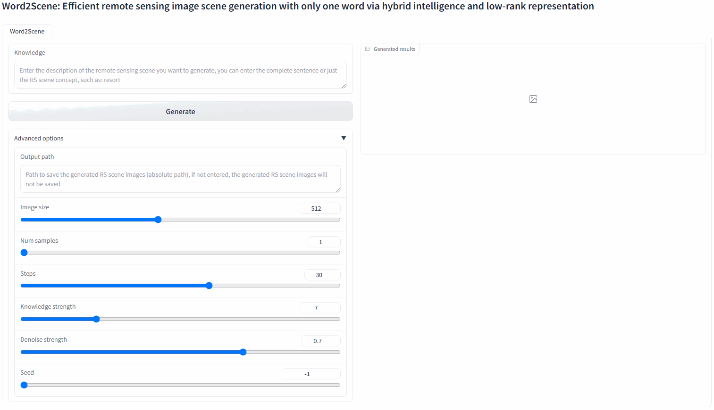

<h1 align="center">Word2Scene: Efficient remote sensing image scene generation with only one word via hybrid intelligence and low-rank representation</h1>


    

This is an ongoing project. We will continuously enhance the model's performance. Click the `Star`**` in the top right corner to follow us and stay updated with the latest models and code!
### :fire: Updates
* **[2024.12.11]** We have released the weight file of Word2Scene, please follow the steps below to get it: [2.1. Instructions for Obtaining Model Weights](#download)
* **[2024.11.03]** We have released the evaluation script and pre-trained model for GSHPS, feel free to try it out.

### :star: Visualization
[Word2Scene GUI](https://github.com/user-attachments/assets/f2f6e5a1-b062-4564-8434-81ce02fd2d0f)

[Preview of the generation process](https://github.com/user-attachments/assets/8e70d0fe-1dde-49f6-9385-c550654e7be1)

### Table of content
1. [Preparation](#preparation)
2. [Using Word2scene to Generate Remote Sensing Images](#Word2Scene)
3. [Evaluate Generated Images with GSHPS](#GSHPS)
4. [Examples](#gen)
5. [Interpretability of Word2Scene](#interpretability)
6. [Paper](#paper)
7. [Acknowledgement](#acknowledgement)
8. [License](#license)

### 1.Preparation
- Install required packages: `pip install -r requirements.txt`
  

### 2. Using Word2scene to Generate Remote Sensing Images <a name="Word2Scene"></a>

To clone the [Stable Diffusion web UI](https://github.com/AUTOMATIC1111/stable-diffusion-webui)  to your local machine, use the following command:

```bash
git clone https://github.com/AUTOMATIC1111/stable-diffusion-webui -b v1.6.1
```
In `webui-user.bat`, add the following parameters to `COMMANDLINE_ARGS`:

```bash
set COMMANDLINE_ARGS=--enable-console-prompts --api --api-log
```
Download the [stable diffusion v1.5 pre-trained model (v1-5-pruned.ckpt)](https://cdn-lfs.hf.co/repos/66/6f/666f465fa70158515404e8de2c6bc6fe2f90c46f9296293aa14daededeb32c52/e1441589a6f3c5a53f5f54d0975a18a7feb7cdf0b0dee276dfc3331ae376a053?response-content-disposition=attachment%3B+filename*%3DUTF-8%27%27v1-5-pruned.ckpt%3B+filename%3D%22v1-5-pruned.ckpt%22%3B&Expires=1730965062&Policy=eyJTdGF0ZW1lbnQiOlt7IkNvbmRpdGlvbiI6eyJEYXRlTGVzc1RoYW4iOnsiQVdTOkVwb2NoVGltZSI6MTczMDk2NTA2Mn19LCJSZXNvdXJjZSI6Imh0dHBzOi8vY2RuLWxmcy5oZi5jby9yZXBvcy82Ni82Zi82NjZmNDY1ZmE3MDE1ODUxNTQwNGU4ZGUyYzZiYzZmZTJmOTBjNDZmOTI5NjI5M2FhMTRkYWVkZWRlYjMyYzUyL2UxNDQxNTg5YTZmM2M1YTUzZjVmNTRkMDk3NWExOGE3ZmViN2NkZjBiMGRlZTI3NmRmYzMzMzFhZTM3NmEwNTM%7EcmVzcG9uc2UtY29udGVudC1kaXNwb3NpdGlvbj0qIn1dfQ__&Signature=Kj9H5WPyd6D1Mp0R3%7EF90TO6i6niEA1RkaeJXylk4HmsMhgAea-FmZrbmCfBXC4O03mFQllGVelLKiBDpStfwkdpoEtYQ56yya9p%7ErxrabX8ueP-7CByom6pXW02f1zB-pGkdGiYNA869VPlQW4jzNDjw8JXnDvXH6jAnqmcslbRQsJS4zfntTFRqCiFK0bx7zZoOvdaEhgmKigL0tBt06ZjZYbintrduCJ8ob1UmPEYIbjoTJ2VxOAXjeaR0SxbtmINnjM23pyQAwR%7Eb2nXppdL6to0GmkCUVDeec7vlNcSWox3gAFsXuVvwSX5mopNpj%7Eei5mnaNAj0mntp2o73w__&Key-Pair-Id=K3RPWS32NSSJCE)  locally and place it in the `models\Stable-diffusion` folder. 

Note: After downloading the model, you should check if the downloaded model is complete. The MD5 value of `v1-5-pruned.ckpt` is `fde08ee6f4fac7ab26592bf519cbb405`.

Then, download the [Word2Scene](https://pan.baidu.com/s/1mJb9A2SS8evjGPjYJqn8BA)  model we provided (please refer to [2.1. Instructions for Obtaining Model Weights](#download)) and place it in the `models\Lora` folder.

Launch the `Stable Diffusion web UI` and set the `Stable Diffusion checkpoint` to `v1-5-pruned.ckpt`:


Run the `Word2Scene GUI`:

```bash
python word2scene_gui.py
```
In `Word2Scene GUI`, input any textual description or scene concept for the remote sensing imagery you want to generate. 

Click the `Generate` button to create the corresponding remote sensing image:




#### 2.1. Instructions for Obtaining Model Weights <a name="download"></a>

This is an ongoing project. To track and manage the model, as well as to better support and improve the project, the weights for Word2Scene are currently obtained through a voluntary application process. Additionally, to prevent the misuse of the model due to unauthorized access to the weight files, we have disabled the `issue` module on `GitHub`. If you need to use Word2Scene, please apply to obtain it by following the steps below:

**1. Fill out the application email:**  Please fill in your relevant information according to the application form template below.

**2. Send the application email:**  Send the completed application form to our contact email: `jaycecd@foxmail.com`.

**3. Obtain the download password:**  After receiving your application email, we will review your information as soon as possible and inform you of the cloud storage verification code via a reply email, allowing you to download the model weights.

**4. Application Form Template** 

Please include the following in your email:

---
_Subject: [Obtaining Word2Scene Model Weights]_

_Name: [Your full name]_
 
_Institution: [Your institution or organization name]_
 
_Position: [Your position or role, e.g., PhD student, researcher, etc.]_
 
_Research Field: [Briefly describe your research field]_
 
_Intended Use: [Briefly explain the intended use of the model weights]_
 
_Contact Email: [Your email address]_

_I hereby commit to using the model weights solely for scientific research purposes, not for any commercial use, and to comply with the relevant provisions of the open-source license. Furthermore, I understand that any problems or losses arising during the use of the model are my own responsibility, and the authors are exempt from liability (after all, if the model behaves mischievously, even the authors can't control it)._

---

### 3. Evaluate Generated Images with GSHPS <a name="GSHPS"></a>
We have released the GSHPS (Geographic Scene Holistic Perceptual Similarity) evaluation script and model for assessing the quality of generated images. You can use our script to evaluate the quality of your generated images.

#### 3.1. Preparation 
 
- Ensure that you have installed the dependencies specified in `requirements.txt`.
 
- Download the pre-trained classification model for GSHPS evaluation:
 
  - [Pre-trained classification model (gshps_vgg16.pt, code: lz9p)](https://pan.baidu.com/s/1UimjwvB0nwQaALvOJXA1Lw )

  
Note: The classification model includes 11 scene categories mentioned in the paper: heterogeneous scene assembly (HeSA), which encompasses church, commercial, dense residential, industrial, medium residential, park, railway station, resort, school, sparse residential, and square, totaling 11 categories. Surprisingly, even if your category is not among these 11 categories, GSHPS can roughly assess the similarity of the unknown category image, though it cannot determine the specific class of the image under evaluation. However, if your sample falls outside these 11 categories and requires a more precise evaluation, retraining a scene classification model may be necessary. Fortunately, classification models are currently quite straightforward to train.

#### 3.2. Usage 

The GSHPS evaluation script computes a similarity metric by comparing your generated images with reference images. You can use our pre-trained classification model or train your own classification model to replace ours.

To compute the GSHPS metric, run the script calculate_gshps.py with the following arguments:
```bash
--ref: Path to the reference images folder.
--gen: Path to the generated images folder.
--batch_size: (Optional) Batch size for data loading. Default is 32.
--classification_model: (Optional) Path to the classification model.
```
##### 3.2.1. Using the Pre-trained Classification Model 
 
1. **Prepare image data:**  
  - Place your reference images in a folder, e.g., `path/to/reference_images/`.
 
  - Place your generated images in another folder, e.g., `path/to/generated_images/`.

  - Ensure that the image filenames in both folders are the same to allow correct matching.
 
2. **Run the GSHPS evaluation script:** 

```bash
python calculate_gshps.py --ref path/to/reference_images/ --gen path/to/generated_images/
```
The script will output the GSHPS score

##### 3.2.2. Training Your Own Classification Model 

If you wish to use your own classification model:
 
1. **Train your model:** 
  - Train a classification model suitable for your dataset.
 
2. **Run the GSHPS evaluation script:**  
  - Run the script as before, specifying the path to your model:

```bash
python calculate_gshps.py --ref path/to/reference_images/ --gen path/to/generated_images/ --classification_model path/to/your_classification_model.pt
```

#### 3.3. Notes 
 
- **Image filename matching:**  The reference and generated images should have the same filenames to ensure correct matching and GSHPS computation.
 
- **Image formats:**  Ensure that the images in both folders are in the same format and contain only image files.
 
- **Model compatibility:**  The classification model should be compatible with the feature extraction part in the script. By default, the script uses features from VGG16.
 
- **Folder structure:**  The script assumes that the reference and generated images are located in flat directories without subfolders. If your images are organized differently, you may need to adjust the script accordingly.


### 4.Examples <a name="gen"></a>
- **Word2Scene:** Visualization of remote sensing scenes generated from text descriptions in the test set using different text-to-image generation methods. Zoom-in for better details.


- **Word2Scene-C:** Directly generate scenes using scene concepts from the training set. The real image is randomly selected from the images in the corresponding scene concept. Zoom-in for better details.


- **Word2Scene Zero-shot:** Directly generate scenes using scene concepts outside the training set (zero-shot). Zoom-in for better details.


- **Diversity and stability:** These samples were all randomly generated 9 times using the same description on different methods. 


- Comparison of the models obtained at different epochs with the results generated at different lora strengths. 


### 5.Interpretability of Word2Scene <a name="interpretability"></a>
- **How does textual input specifically influence the outcome of scene generation?**

    Using heatmaps to explain how text influences scene generation.


### 6.Paper <a name="paper"></a>
**[Word2Scene: Efficient remote sensing image scene generation with only one word via hybrid intelligence and low-rank representation](https://www.sciencedirect.com/science/article/pii/S0924271624004106)**

If you find it useful, we kindly request that you leave a star on our GitHub repository. 

Should you incorporate Word2Scene into your research, please cite the Word2Scene article:
```
@article{REN2024231,
title = {Word2Scene: Efficient remote sensing image scene generation with only one word via hybrid intelligence and low-rank representation},
journal = {ISPRS Journal of Photogrammetry and Remote Sensing},
author = {Jiaxin Ren and Wanzeng Liu and Jun Chen and Shunxi Yin and Yuan Tao},
volume = {218},
pages = {231-257},
year = {2024},
issn = {0924-2716},
doi = {https://doi.org/10.1016/j.isprsjprs.2024.11.002},
url = {https://www.sciencedirect.com/science/article/pii/S0924271624004106}
}
```

### 7.Acknowledgement <a name="acknowledgement"></a>
+ [LoRA](https://github.com/microsoft/LoRA). This repo contains the source code of the Python package loralib and several examples of how to integrate it with PyTorch models.
+ [BLIP](https://github.com/salesforce/BLIP). A model that unifies the framework for visual-language pre-training and fine-tuning, enabling multimodal learning and cross-modal understanding. 
+ [Stable Diffusion](https://github.com/CompVis/stable-diffusion). Stable Diffusion is a latent text-to-image diffusion model. We use it to generate the text-to-image samples.
+ [Stable Diffusion web UI](https://github.com/AUTOMATIC1111/stable-diffusion-webui). A web interface for Stable Diffusion, implemented using Gradio library. We use it to load the generated LoRA model and generate remote sensing scenes.


### 8.License <a name="license"></a>
This repo is distributed under [GPL License](https://github.com/jaycecd/Word2Scene/blob/main/LICENSE). The code can be used for academic purposes only.
